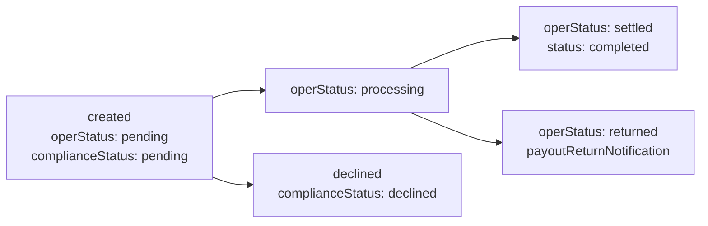
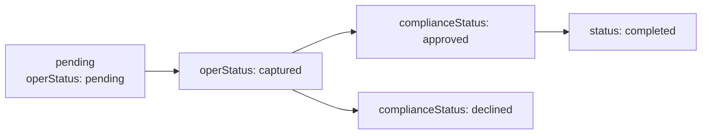

# Clear Junction — Features & Field-by-Field Reference

| | |
|---|---|
| **Document type** | Deep field-level reference (every feature + every field) |
| **Audience** | Product, BA, integration engineers, QA, ops |
| **API version** | `v7` (gate) |
| **Source** | [Apiary export](https://clearjunctionrestapi.docs.apiary.io/) (2026-04-22) + [Clear Junction product pages](https://clearjunction.com/) |
| **Companion document** | `ClearJunction-Payin-Payout-Multicurrency-Integration.md` |

> Every example value below comes from the Clear Junction Apiary blueprint. "Scope" describes the **business purpose** of the field — when you set it, who reads it, and the consequence of getting it wrong.

---

## 0. How to read this document

| Column | Meaning |
|---|---|
| **Field** | Dotted path inside the JSON body |
| **Type** | Primitive (string / number / boolean / array / object / UUID / ISO-8601 / ISO-3166 / ISO-4217) |
| **Required** | Mandatory / Conditional / Optional. "Conditional" lists the rule |
| **Sample** | Verbatim from Apiary spec |
| **Scope** | Why the field exists, what it influences downstream, and pitfalls |

Status convention:

- **`status`** — order-level lifecycle (e.g. `created`, `pending`, `accepted`, `completed`).
- **`subStatuses.operStatus`** — operational pipeline (e.g. `pending`, `captured`, `processing`, `settled`, `declined`).
- **`subStatuses.complianceStatus`** — AML/sanctions pipeline (e.g. `pending`, `approved`, `declined`).

---

## 1. Foundation — applied to every endpoint

### 1.1 Transport & headers

| Header | Type | Sample | Scope |
|---|---|---|---|
| `Date` | ISO-8601 UTC | `2017-06-22T11:40:51.620Z` | Anti-replay marker; used in signature calculation |
| `X-API-KEY` | UUID | `730ee406-817e-11e7-bb31-be2e44b06b34` | Identifies the API consumer (your institution) |
| `Authorization` | hex string | `34695d044dc52d3…ed29038` | Request signature derived from `X-API-KEY` + `Date` + `body` + modified `apiPassword` |
| `Content-Type` | string | `application/json` | All bodies are JSON |

### 1.2 Universal response wrappers

| Field | Type | Sample | Scope |
|---|---|---|---|
| `requestReference` | UUID | `12d603fa-4d0b-4fec-a9b0-cc3114da134e` | Per-HTTP-request trace id. Quote it to CJ support |
| `orderReference` | UUID | `12d603fa-4d0b-4fec-a9b0-cc3114da134e` | CJ's persistent id for the **business order** (payout/payin/refund/FX/IBAN). Use for status calls |
| `clientOrder` | string | `999899-0005` | **You** mint this. Idempotency key — never reuse for different orders |
| `createdAt` / `operTimestamp` | ISO-8601 | `2017-09-05T10:37:15+00:00` | Server-side timestamp; primary source of truth for ordering |
| `status` | enum | `created`, `pending`, `accepted`, `completed`, `declined` | High-level lifecycle |
| `subStatuses.operStatus` | enum | `pending`, `captured`, `processing`, `settled`, `declined` | Operational state machine |
| `subStatuses.complianceStatus` | enum | `pending`, `approved`, `declined` | AML/sanctions outcome |
| `messages[]` | object[] | see §1.3 | Soft warnings — request may still succeed |

### 1.3 Message object (warnings) — shared by every response

| Field | Type | Sample | Scope |
|---|---|---|---|
| `messages[].code` | string | `008` | Stable warning code — map to user-facing copy |
| `messages[].message` | string | `Incorrect recipient details` | Short label |
| `messages[].details` | string | `Please check account number.` | Free-text hint for ops |

### 1.4 Error object — non-2xx

| Field | Type | Sample | Scope |
|---|---|---|---|
| `errors[].code` | string/int | `10`, `"30"` | Numeric error code |
| `errors[].message` | string | `Validation error` | Category label |
| `errors[].details` | string | `Wrong period dates` | Explains the offending field |

HTTP code semantics: **200 OK**, **201 Created**, **400 Bad Request**, **401 Unauthorized** (signature failed), **404 Not Found**, **409 Conflict** (body validation), **500** (CJ internal).

---

## 2. Reusable building blocks

These objects appear in many endpoints. **Learn them once.**

### 2.1 `address` — postal address (ISO-3166 country code)

| Field | Type | Sample | Required | Scope |
|---|---|---|---|---|
| `country` | ISO-3166 alpha-2 | `IT` | Yes | Drives sanctions screening and corridor routing |
| `zip` | string | `123455` | Yes | Postal code; format varies by country |
| `city` | string | `Rome` | Yes | Used in SWIFT MT103 ordering customer field |
| `street` | string | `12 Tourin` | Yes | Full street including number |
| `addressOneString` | string | `IT, DSS, 123455, Rome, 12 Tourin` | Yes (returned only) | Concatenated form sometimes echoed in notifications |

### 2.2 `document` — identity document (mainly individuals)

| Field | Type | Sample | Required | Scope |
|---|---|---|---|---|
| `type` | enum | `passport`, `idCard`, `drivingLicence` | Cond. (rail-dependent) | Determines validity rules |
| `number` | string | `AB1000222` | Yes | Document number — keep verbatim from the source document |
| `issuedCountryCode` | ISO-3166 | `IT` | Yes | Issuing authority country |
| `issuedBy` | string | `Ministry of Interior` | Yes | Free text — used for KYC audit |
| `issuedDate` | ISO date | `2016-12-21` | Yes | Cannot be in the future |
| `expirationDate` | ISO date | `2026-12-20` | Yes | Must be in the future at order time |

### 2.3 `individual` — natural person entity

| Field | Type | Sample | Required | Scope |
|---|---|---|---|---|
| `firstName` | string | `Julie` | Yes | Given name on bank statement / KYC |
| `lastName` | string | `Peterson` | Yes | Surname |
| `middleName` | string | `Maria` | Optional | Used when required by destination corridor |
| `phone` | E.164 (no +) | `34712345678` | Cond. | Contact for compliance follow-up |
| `email` | email | `peterson.julie@example.com` | Cond. | Notifications, CoP, eIDV |
| `birthDate` | ISO date | `1999-09-29` | Yes | Used by sanctions / PEP screening |
| `birthPlace` | string | `'Madrid, Spain'` | Cond. (SWIFT, EU) | Often required for cross-border |
| `birthCountry` | ISO-3166 | `IT` | Cond. (IBAN V3) | Required for vIBAN registration |
| `taxNumber` | string | `7728168971` | Cond. | Tax id / TIN / fiscal code |
| `taxCountry` | ISO-3166 | `IT` | Cond. | Tax residency country |
| `inn` | string | `7728168971` | Cond. (card pay-in) | Tax id alias for legacy markets |
| `address` | object | see §2.1 | Yes | Residential address |
| `document` | object | see §2.2 | Cond. | KYC document |

### 2.4 `corporate` — legal entity

| Field | Type | Sample | Required | Scope |
|---|---|---|---|---|
| `name` | string | `SuperBubble Limited` | Yes | Legal name on incorporation certificate |
| `email` | email | `peterson.julie@example.com` | Yes | Primary contact |
| `phone` | E.164 | `34712345678` | Cond. | Compliance contact |
| `registrationNumber` | string | `AAB2827377-837` | Yes | Companies-house / registry number |
| `incorporationCountry` | ISO-3166 | `IT` | Yes | Country of incorporation |
| `incorporationDate` | ISO date | `2016-12-21` | Yes | Date legal entity was formed |
| `address` | object | see §2.1 | Yes | Registered office address |
| `legalEntityIdentifier` | LEI | `222200WWAABBBCCCDD33` | Cond. (CHAPS Cross-scheme, SWIFT, GB) | 20-char ISO 17442 LEI |
| `taxCountry` | ISO-3166 | `IT` | Cond. | Tax residency |
| `taxNumber` | string | `7728168971` | Cond. | Tax id |
| `industryType` | string | `Electronics Distributor` | Cond. (wallet reservation) | Industry / SIC description |
| `publicallyTraded` | boolean | `true` | Cond. | Disclose if listed |
| `stockSymbol` | string | `APA` | Cond. | If publicly traded |
| `stockExchange` | string | `NYSE` | Cond. | If publicly traded |
| `ultimateBeneficialOwner[]` | object[] | see §2.5 | Cond. | UBOs ≥ 25% — KYC for AML |
| `tradingWebsite` | URL | `https://www.geotriangle.com` | Cond. | Public web presence |
| `expectedTurnover` | number (EUR) | `1000000` | Cond. (wallet) | Estimated annual turnover |
| `beneficialLegalEntity` | string | `Solomon S.A. owns Michigan Ltd…` | Cond. | Free-text ownership chain narrative |
| `otherDetails.businessActivity` | string | `Michigan Ltd. is one of the leading developers…` | Cond. | Activity description |
| `otherDetails.relevantInformation` | string | `Michigan Ltd. enters to TOP-500 of Forbes.` | Cond. | Positive context |
| `otherDetails.negativeInformation` | string | `none` | Cond. | Adverse media disclosure |
| `businessPartners[]` | object[] | see §2.6 | Cond. | Top counterparties |
| `fundFlows.plannedIncTransfersQuantity` | int | `0` | Cond. | Expected inbound count / month |
| `fundFlows.plannedIncTransfersEurVolume` | number | `0` | Cond. | Expected inbound EUR / month |
| `fundFlows.plannedOutTransfersQuantity` | int | `0` | Cond. | Expected outbound count / month |
| `fundFlows.plannedOutTransfersEurVolume` | number | `0` | Cond. | Expected outbound EUR / month |
| `complianceEvaluation.amlRiskLevel` | enum | `Low`, `Medium`, `High` | Cond. | Client-asserted AML risk |
| `complianceEvaluation.reviewPeriodicity` | string | `1 per year` | Cond. | KYC refresh cadence |
| `complianceEvaluation.appliedLimits` | string | `none` | Cond. | Pre-applied transactional limits |
| `customOptions` | object | see §2.7 | Optional | Arbitrary client metadata |
| `isMicroEnterprise` | boolean | `false` | Cond. | EU PSD2 micro-enterprise flag |

### 2.5 `ultimateBeneficialOwner[]` — UBO (KYC)

| Field | Type | Sample | Required | Scope |
|---|---|---|---|---|
| `firstName` | string | `Ioan` | Yes | UBO given name |
| `lastName` | string | `Ivanov` | Yes | UBO surname |
| `birthDate` | ISO date | `1990-01-12` | Yes | Date of birth — sanctions screening |
| `ownership` | number (%) | `100` | Yes | Stake percentage (decimal allowed) |
| `document` | object | see §2.2 | Yes | UBO's identity doc |
| `beneficialOwnerPep` | boolean | `true` | Yes | Politically Exposed Person flag |
| `beneficialOwnerPepDetails` | string | `BO is PEP relative of the vice-president of the USA` | Cond. | If `beneficialOwnerPep=true` |
| `usaTaxResidency` | boolean | `true` | Yes | FATCA flag |
| `giinNumber` | string | `""` | Cond. | FATCA Global Intermediary Identification Number |

### 2.6 `businessPartners[]`

| Field | Type | Sample | Required | Scope |
|---|---|---|---|---|
| `name` | string | `""` | Yes | Partner legal name |
| `incorporationCountryCode` | ISO-3166 | `""` | Yes | Country of incorporation |
| `plannedTransfersQuantityMonth` | int | `0` | Yes | Monthly transfer count with partner |
| `plannedTransfersEurVolumeMonth` | number | `0` | Yes | Monthly EUR volume with partner |
| `basisPartnership` | string | `""` | Yes | Contractual basis ("framework", "spot", etc.) |
| `website` | URL | `""` | Optional | Partner website |

### 2.7 `customInfo` / `customFormat`

Free-form objects that **round-trip back** to your platform on every webhook.

| Field | Type | Sample | Scope |
|---|---|---|---|
| `customInfo.*` | object/string/array | `{ "MyExampleParam1": "exampleValue1" }` | Stored verbatim by CJ; echoed on notifications. Use for internal correlation (e.g. internal user id, campaign id) |
| `customFormat.*` | object | `{ "clientCustomAttributeExample": "This value I need" }` | Same purpose; alternate name used in some responses |

### 2.8 `paymentPurposeCodes`

| Field | Type | Sample | Required | Scope |
|---|---|---|---|---|
| `code` | string | `INTP` | Cond. (corridor) | Granular purpose-of-payment ISO 20022 code |
| `category` | string | `GP2P` | Cond. | Category (e.g. P2P, B2B). Required for many SWIFT corridors |

### 2.9 `requisite` (`payerRequisite` / `payeeRequisite`)

Schema **varies by rail** — see §4 for per-rail expectations. The union of all fields:

| Field | Type | Sample | Scope |
|---|---|---|---|
| `name` | string | `Peterson Julie` | Account holder name on the destination/source bank account |
| `iban` | IBAN | `GB00CLJU00000011111111` | International Bank Account Number |
| `accountNumber` | string | `11111111` | UK 8-digit account number (FPS/CHAPS/BACS) |
| `sortCode` | string | `000000` | UK 6-digit sort code |
| `bankSwiftCode` | BIC | `UBSWCHZH80A` | 8 or 11-char SWIFT BIC of beneficiary's bank |
| `secondaryReferenceData` | string | `000001` | Building Society roll number (UK) — CoP only |
| `walletUuid` | UUID | `348e11ab-dbfb-4ae8-99e7-349b00868f6f` | For wallet-to-wallet transfers |
| `institution` | object | see §2.10 | SWIFT beneficiary bank |
| `intermediaryInstitution` | object | see §2.10 | Correspondent bank for SWIFT |

### 2.10 `institution` — bank object (SWIFT)

| Field | Type | Sample | Required | Scope |
|---|---|---|---|---|
| `bankSwiftCode` | BIC | `UBSWCHZH80A` | Yes | Bank's SWIFT BIC |
| `clearingSystemIdCode` | enum | `ABA`, `CHIPS`, `CHAPS`, `FEDWIRE` | Cond. | Local clearing system code (US ABA most common) |
| `memberId` | string | `62116001` | Cond. | Local clearing member id (e.g. ABA routing number) |
| `name` | string | `Bank of America` | Yes | Bank full legal name |
| `address` | object | see §2.1 | Yes | Bank registered address |

### 2.11 `entity` wrappers — `payer`, `payee`, `ultimatePayer`, `ultimatePayee`, `registrant`, `holder`

A common envelope that mixes wallet/customer ids with KYC payload:

| Field | Type | Sample | Required | Scope |
|---|---|---|---|---|
| `clientCustomerId` | string | `2983ght938` | Cond. | Your customer id — joins CJ records to your CRM |
| `walletUuid` | UUID | `348e11ab-dbfb-4ae8-99e7-349b00868f6f` | Cond. | CJ wallet for this customer |
| `individual` | object | see §2.3 | Either `individual` or `corporate` | Natural person KYC |
| `corporate` | object | see §2.4 | Either `individual` or `corporate` | Legal entity KYC |

> **`ultimatePayer` / `ultimatePayee`** — used when the **originator/beneficiary of funds** differs from the account holder (typical for remittance providers).

---

## 3. Pay-out feature — `POST /v7/gate/payout/...`

### 3.1 Scope

Submit a payment instruction from your CJ balance to a destination account. **One endpoint per rail.** Common request shape; the only differences are the `payeeRequisite` (and sometimes `payerRequisite`) content and the entity-detail validation rules.

### 3.2 Common request fields (all rails)

| Field | Type | Sample | Required | Scope |
|---|---|---|---|---|
| `clientOrder` | string | `999899-0005` | Yes | **Idempotency key**. Same value → CJ returns the existing order |
| `currency` | ISO-4217 | `EUR`, `GBP`, `USD` | Yes | Settlement currency. Must match a CJ-supported corridor for the chosen rail |
| `amount` | decimal | `210.55` | Yes | Up to 2 decimals for fiat. Validated against your balance & per-rail limits |
| `description` | string | `Birthday present` | Yes | Remittance information — appears on beneficiary's statement |
| `paymentPurposeCodes.code` | string | `INTP` | Cond. | Purpose code (see §2.8) |
| `paymentPurposeCodes.category` | string | `GP2P` | Cond. | Purpose category |
| `postbackUrl` | URL | `https://www.www.geotriangle.com/postbacks` | Recommended | Per-order webhook override |
| `payer` | object | see §2.11 | Yes | Debit-side customer / wallet (with `individual` or `corporate`) |
| `payee` | object | see §2.11 | Yes | Beneficiary customer (with `individual` or `corporate`) |
| `ultimatePayer` | object | see §2.11 | Cond. (remittance, SWIFT) | Originator of funds (if ≠ payer) |
| `ultimatePayee` | object | see §2.11 | Cond. (remittance, SWIFT) | Beneficiary of funds (if ≠ payee) |
| `payerRequisite` | object | see §2.9 | Yes | Source bank details |
| `payeeRequisite` | object | see §2.9 | Yes | Destination bank details — **rail-specific** |
| `customInfo` | object | `{"MyExampleParam1":"exampleValue1"}` | Optional | Round-tripped client metadata |

### 3.3 Common response (201 Created)

| Field | Type | Sample | Scope |
|---|---|---|---|
| `requestReference` | UUID | `12d603fa-4d0b-4fec-a9b0-cc3114da134e` | HTTP trace id |
| `clientOrder` | string | `999899-0005` | Echo of your id |
| `orderReference` | UUID | `12d603fa-4d0b-4fec-a9b0-cc3114da134e` | CJ order id for status calls |
| `createdAt` | ISO-8601 | `2017-09-05T10:37:15+00:00` | CJ-side timestamp |
| `status` | enum | `created` | Initial lifecycle state |
| `subStatuses.operStatus` | enum | `pending` | Initial operational state |
| `subStatuses.complianceStatus` | enum | `pending` | Initial AML state |
| `messages[]` | array | see §1.3 | Soft warnings |
| `customFormat` | object | `{"clientCustomAttributeExample":"This value I need"}` | CJ-returned custom metadata |

### 3.4 Rail-specific endpoints & `payeeRequisite` shape

#### 3.4.1 Internal Payment — `POST /v7/gate/payout/internalPayment`

Move funds **between two parties inside Clear Junction** (free, near-instant, no rail).

| `payeeRequisite` field | Type | Sample | Scope |
|---|---|---|---|
| `iban` | IBAN | `GBXXCLJU04130729900988` | Beneficiary's CJ-issued IBAN |
| `name` | string | `Peterson Julie` | Optional account name |

`paymentMethod` reference entity: **`InternalPayment`** (see §13.3).

#### 3.4.2 SEPA Credit Transfer — `POST /v7/gate/payout/bankTransfer/eu`

EUR transfer to any SEPA reachable EU/EEA account.

| `payeeRequisite` field | Type | Sample | Scope |
|---|---|---|---|
| `iban` | IBAN | `GBXXCLJU04130729900988` | Beneficiary IBAN — must be SEPA-reachable |
| `bankSwiftCode` | BIC | `UBSWCHZH80A` | Beneficiary bank BIC (optional but recommended) |

#### 3.4.3 SEPA Instant — `POST /v7/gate/payout/bankTransfer/sepaInst`

EUR instant (≤ 10 s) to SCT-Inst capable banks.

| `payeeRequisite` field | Type | Sample | Scope |
|---|---|---|---|
| `iban` | IBAN | `GBXXCLJU04130729900988` | Must be SCT-Inst reachable. Use `checkRequisite` to validate (see §11) |
| `bankSwiftCode` | BIC | `UBSWCHZH80A` | Optional |

#### 3.4.4 UK Faster Payments — `POST /v7/gate/payout/bankTransfer/fps`

| `payeeRequisite` field | Type | Sample | Scope |
|---|---|---|---|
| `sortCode` | 6-digit | `000000` | UK sort code |
| `accountNumber` | 8-digit | `11111111` | UK account number |
| `iban` | IBAN | `GB00CLJU00000011111111` | Optional GB IBAN |
| `bankSwiftCode` | BIC | `UBSWCHZH80A` | Optional |

Limit ≈ £1,000,000 per FPS payment (scheme rule).

#### 3.4.5 UK CHAPS — `POST /v7/gate/payout/bankTransfer/chaps`

Same shape as FPS but settled via CHAPS (same-day high-value). Required for amounts above FPS limit or when same-day finality is needed.

#### 3.4.6 UK CHAPS Cross-Scheme — `POST /v7/gate/payout/bankTransfer/chapsCrossScheme`

Payer-side requisite uses **`sortCode`+`accountNumber`+`iban`**, payee-side uses **`iban`+`bankSwiftCode`** — bridges UK CHAPS to non-UK rails. Requires `legalEntityIdentifier` (LEI) on corporates.

#### 3.4.7 Multi-Currency SWIFT — `POST /v7/gate/payout/bankTransfer/swift` ***implementing***

| `payeeRequisite` field | Type | Sample | Required | Scope |
|---|---|---|---|---|
| `iban` | IBAN/account | `DE89370400440532013000` | Yes | Beneficiary account (IBAN or local format) |
| `name` | string | `Peterson Julie` | Yes | Beneficiary account name as held by their bank |
| `accountNumber` | string | `11111111` | Cond. | Alt to IBAN where IBAN not available |
| `institution.bankSwiftCode` | BIC | `UBSWCHZH80A` | Yes | Beneficiary bank BIC |
| `institution.clearingSystemIdCode` | enum | `ABA` | Cond. | Local clearing code (US ABA, etc.) |
| `institution.memberId` | string | `62116001` | Cond. | Local clearing member id |
| `institution.name` | string | `Bank of America` | Yes | Beneficiary bank legal name |
| `institution.address` | object | §2.1 | Yes | Bank address |
| `intermediaryInstitution.*` | object | mirrors `institution` | Cond. | When a correspondent / intermediary bank is required |

Use cases: pay-out outside SEPA/UK (USD to US, CAD to Canada, etc.), supplier payments in 11+ currencies after FX.

#### 3.4.8 Card pay-out (non-PCI) — `POST /v7/gate/payout/creditCardNonPci` ***temporary unavailable***

Currently disabled in the spec — push-to-card was a separate scope.

### 3.5 Pay-out status — pull APIs

| Endpoint | Path param | Purpose |
|---|---|---|
| `GET /v7/gate/status/payout/orderReference/{uuid}` | `uuid` = `orderReference` | Status by CJ id |
| `GET /v7/gate/status/payout/clientOrder/{id}` | `id` = your `clientOrder` | Status by your id |

Response fields (in addition to §3.3):

| Field | Type | Sample | Scope |
|---|---|---|---|
| `operTimestamp` | ISO-8601 | `2017-09-05T10:37:15+00:00` | Last operational update |
| `currency` | ISO-4217 | `EUR` | Settlement currency |
| `amount` | decimal | `210.55` | Settlement amount |
| `operationCurrency` | ISO-4217 | `EUR` | Currency CJ debits/credits internally |
| `operationAmount` | decimal | `230.55` | Internal amount (after FX/fees) |
| `productName` | string | `p2p transfer` | Product label |
| `siteAddress` | URL | `https://www.geotriangle.com` | Origin merchant site (card flows) |
| `label` | string | `vip123` | Free-form label |
| `valuedAt` | ISO-8601 / null | `null` | Value date once settled |
| `transactionType` | enum | `Payout` | Discriminator |
| `payer.address.addressOneString` | string | `IT, DSS, 123455, Rome, 12 Tourin` | Concatenated payer address |
| `payee.walletUuid` / `payee.clientCustomerId` | string | … | Stable id of recipient |
| `paymentDetails` | object | rail-specific (see §13) | The verbatim requisite payload sent |

### 3.6 Pay-out webhook — `payoutNotification`

Posted by CJ to your `postbackUrl`. Mirrors the status response plus:

| Field | Type | Sample | Scope |
|---|---|---|---|
| `messageUuid` | UUID | `8a7214dc-b89d-4836-ade3-9a4a50b686e4` | **De-duplicate** webhook deliveries by this |
| `type` | enum | `payoutNotification` | Webhook discriminator |

Respond with HTTP **200** and **body = `orderReference`** (plain text UUID).

### 3.7 Pay-out **return** webhook — `payoutReturnNotification`

Same shape; signals the funds were **returned** by the beneficiary bank (wrong account, recall, etc.). Treat it as a credit reversal on your ledger.

---

## 4. Pay-in feature

### 4.1 Scope

Receive funds from a payer. Two patterns:

1. **Bank pay-in via vIBAN / pooled account** — no API call to initiate. Funds arrive → CJ POSTs a `payinNotification`.
2. **Card pay-in** — explicit `POST /v7/gate/invoice/creditCard` returns a hosted `redirectURL`.

### 4.2 Card / Invoice pay-in — `POST /v7/gate/invoice/creditCard`

| Field | Type | Sample | Required | Scope |
|---|---|---|---|---|
| `clientOrder` | string | `999899-0005` | Yes | Your idempotency key |
| `currency` | ISO-4217 | `EUR` | Yes | Charge currency |
| `amount` | decimal | `210.55` | Yes | Charge amount |
| `description` | string | `Birthday present` | Yes | Statement narrative |
| `productName` | string | `p2p transfer` | Cond. | Product name for risk scoring |
| `siteAddress` | URL | `https://www.geotriangle.com` | Cond. | Merchant origin (3DS) |
| `label` | string | `vip123` | Optional | Internal tag |
| `postbackUrl` | URL | `https://www.www.geotriangle.com/postbacks` | Recommended | Webhook callback |
| `successUrl` | URL | `https://.../success` | Yes | Hosted page redirect on success |
| `failUrl` | URL | `https://.../fail` | Yes | Redirect on failure |
| `payer` | object | §2.11 | Yes | Cardholder identity |
| `payee` | object | §2.11 | Yes | Funds destination (your wallet) |
| `customInfo` | object | see §2.7 | Optional | Echoed in webhook |

Response adds:

| Field | Type | Sample | Scope |
|---|---|---|---|
| `redirectURL` | URL | `https://www.example.com/12e3ds3` | Hosted card form / 3DS — redirect the payer here |
| `subStatuses.operStatus` | enum | `captured` | After successful card authorisation |

### 4.3 Pay-in status APIs

| Endpoint | Purpose |
|---|---|
| `GET /v7/gate/status/invoice/orderReference/{uuid}` | Status by CJ id |
| `GET /v7/gate/status/invoice/clientOrder/{id}` | Status by your id |

Same fields as §3.5 with `transactionType: "Payin"`.

### 4.4 Pay-in webhook — `payinNotification` (vIBAN credits and card payments)

| Field | Type | Sample | Scope |
|---|---|---|---|
| `clientOrder` | string | `999899-0005` | Your id (when known) |
| `orderReference` | UUID | `12d603fa-...` | CJ order |
| `operTimestamp` | ISO-8601 | `2017-09-05T10:37:15+00:00` | When the fund movement was recorded |
| `currency` / `amount` | … | `EUR` / `210.55` | Settled funds |
| `operationCurrency` / `operationAmount` | … | `EUR` / `230.55` | Internal accounting amounts (differ if FX applied) |
| `productName` / `siteAddress` / `label` | … | as above | Tags |
| `status` / `subStatuses` | enum | `pending` / `captured` / `pending` | Lifecycle |
| `transactionType` | enum | `Payin` | Discriminator |
| `payer.address.country` | ISO-3166 | `IT` | Originator info from bank statement |
| `payee.walletUuid` / `payee.clientCustomerId` | … | … | Where funds were credited |
| `paymentDetails` | object | rail-specific | Source bank's payment metadata |
| `messageUuid` | UUID | `8a7214dc-...` | Dedup key |
| `type` | enum | `payinNotification` | Discriminator |

Respond with **200** + body = `orderReference`.

---

## 5. Refund feature

### 5.1 Scope — return previously captured funds to the original payer

Used for: card refund, pay-in reversal, payout return processing.

### 5.2 Create refund — `POST /v7/gate/refund`

| Field | Type | Sample | Required | Scope |
|---|---|---|---|---|
| `clientOrder` | string | `999899-0005` | Yes | New idempotency key for the refund |
| `postbackUrl` | URL | `https://.../postbacks` | Recommended | Per-refund webhook |
| `relatedOrderReference` | UUID | `8a934717-72ed-45a2-9730-393a3f04bdf7` | Yes | The **original** order being refunded |
| `description` | string | `Birthday present` | Yes | Reason / reference shown to payer |

Response includes `status: created`, `subStatuses.operStatus: created`, and a new `orderReference`.

### 5.3 Refund status — `GET /v7/gate/status/refund/{orderReference|clientOrder}/{id}`

Returns the same shape as pay-in status with `transactionType: "Refund"` and `relatedOrderReference` linking back to the original transaction.

### 5.4 Refund webhook — `refundNotification`

Same envelope as pay-in/out notification; `type: refundNotification`.

---

## 6. Foreign Exchange (Instant FX)

### 6.1 Scope

Convert held balance from one currency wallet position to another **before or between** a pay-in and pay-out — supports multi-currency remittance.

### 6.2 Step 1 — get a quote — `POST /v7/gate/fx/instant/rate`

| Field | Type | Sample | Required | Scope |
|---|---|---|---|---|
| `sellCurrency` | ISO-4217 | `EUR` | Yes | Source currency |
| `buyCurrency` | ISO-4217 | `USD` | Yes | Target currency |

Response:

| Field | Type | Sample | Scope |
|---|---|---|---|
| `quotes[].rateUuid` | UUID | `8a7214dc-b89d-4836-ade3-9a4a50b686e4` | **Token** to execute the conversion. Pass to `transfer` |
| `quotes[].quote` | string decimal | `1.1810` | Mid quote (sell→buy) |
| `quotes[].sellCurrency` | ISO-4217 | `EUR` | Quote direction |
| `quotes[].buyCurrency` | ISO-4217 | `USD` | Quote direction |
| `quotes[].expirationTimestamp` | ISO-8601 | `2017-09-05T10:37:15+00:00` | After this, the rate is invalid (typ. minutes) |

CJ returns **both directions** so you can compute either side. Typical operating window: **06:00–15:00 UK**. Outside that window, expect a validation error.

### 6.3 Step 2 — execute — `POST /v7/gate/fx/instant/transfer`

| Field | Type | Sample | Required | Scope |
|---|---|---|---|---|
| `clientOrder` | string | `999899-0005` | Yes | Idempotency key |
| `postbackUrl` | URL | `https://.../postbacks` | Recommended | Per-trade webhook |
| `sellAmount` | decimal | `100.0` | Yes (one of sell/buy) | Amount you sell |
| `buyAmount` | decimal | `118.1` | Yes (one of sell/buy) | Amount you receive |
| `sellCurrency` | ISO-4217 | `EUR` | Yes | Must match the quote |
| `buyCurrency` | ISO-4217 | `USD` | Yes | Must match the quote |
| `rateUuid` | UUID | `8a7214dc-…e4` | Yes | The token returned by `/rate` — single use |

Response 201 returns `status: pending`, the same `rateUuid`, the locked `quote`, `orderReference`, `requestReference`, `createdAt`. Error `010` (`Invalid target amount`) means the buy/sell math doesn't match the rate.

### 6.4 FX status

| Endpoint | Purpose |
|---|---|
| `GET /v7/gate/fx/instant/status/orderReference/{uuid}` | Status by CJ id |
| `GET /v7/gate/fx/instant/status/clientOrder/{id}` | Status by your id |

### 6.5 FX webhook — `instantFxTransferNotification`

Same envelope; key fields: `sellAmount`, `sellCurrency`, `buyAmount`, `buyCurrency`, `quote`, `status`, `rateUuid`.

### 6.6 Typical FX limits (partner documentation)

| Constraint | Typical value |
|---|---|
| Min trade | 500 EUR/GBP/USD equivalent |
| Max trade | ~200,000 EUR equivalent |
| Daily volume | ~1,000,000 EUR equivalent |
| Daily trades | 50 |
| Operating hours | 06:00–15:00 UK |

---

## 7. Virtual Accounts (vIBAN / Wallet allocation)

### 7.1 Scope

- **Allocate** a customer-specific IBAN that auto-credits funds to a wallet.
- **Close** / **inspect** virtual accounts.
- **Link** crypto and fiat accounts (where eligible).

### 7.2 Allocate IBAN V3 — `POST /v7/gate/allocate/v3/create/iban`

| Field | Type | Sample | Required | Scope |
|---|---|---|---|---|
| `clientOrder` | string | `999899-0005` | Yes | Idempotency |
| `postbackUrl` | URL | `https://.../postbacks` | Recommended | Notification target |
| `walletUuid` | UUID | `348e11ab-dbfb-4ae8-99e7-349b00868f6f` | Yes | Wallet the IBAN funds will credit |
| `ibansGroup` | string | `DEFAULT` | Yes | CJ-configured IBAN pool (assigned at onboarding) |
| `ibanCountry` | ISO-3166 | `GB` | Yes | Country prefix of generated IBAN (`GB`, `DE`, etc.) |
| `registrant.clientCustomerId` | string | `2983ght938` | Yes | Your customer id |
| `registrant.individual` | object | §2.3 + `birthCountry`, `taxNumber`, `taxCountry` | Cond. | Use **either** individual or corporate |
| `registrant.corporate` | object | §2.4 (rich) | Cond. | Corporate vIBANs (see §2.4 wealth of fields) |
| `customInfo` | object | see §2.7 | Optional | Echoed |

Response: `status: accepted` and an `orderReference`. The actual IBAN is delivered via the allocation **notification** once provisioned.

### 7.3 Allocation status — `GET /v7/gate/allocate/v2/status/iban/orderReference/{uuid}` or `…/clientOrder/{id}`

| Field | Type | Sample | Scope |
|---|---|---|---|
| `status` | enum | `allocated`, `pending`, `rejected` | Provisioning state |
| `iban` | IBAN | `GB00CLJU00000011111111` | Issued IBAN (after `allocated`) |
| `messages[]` | array | see §1.3 | Validation warnings (e.g. `Invalid firstName`) |

### 7.4 IBAN list — `GET /v7/gate/allocate/v2/list/iban/{clientCustomerId}`

| Field | Type | Sample | Scope |
|---|---|---|---|
| `clientCustomerId` | string | `2983ght938` | Echo |
| `ibans[]` | IBAN[] | `["GB00CLJU00000011111111", "GB00CLJU00000011111112"]` | All IBANs allocated to that customer |

### 7.5 IBAN info & status — `POST /v7/gate/virtualAccounts/v1/status/iban`

Request: `{ "iban": "GB00CLJU00000011111111" }`

Response:

| Field | Type | Sample | Scope |
|---|---|---|---|
| `walletUuid` | UUID | `348e11ab-…` | Linked wallet |
| `registrant.clientCustomerId` | string | `2983ght938` | Customer |
| `registrant.name` | string | `Peterson Julie` | Display name |
| `actual.virtualAccountStatus` | enum | `closed`, `active`, `pending` | Current state |
| `actual.action` | enum | `allocate`, `activate`, `close` | Last action |
| `actual.actionTimestamp` | ISO-8601 | `2023-08-10T14:48:39+00:00` | When |
| `actual.reason` | string | `Closed by client` | Free text |
| `actual.reasonCode` | string | `VAAC010` | Stable code (`VAAC000` allocation requested, `VAAC001` automatic activation, `VAAC010` closed by client) |
| `history[]` | object[] | array of above | Full audit trail |

### 7.6 Close IBAN — `POST /v7/gate/virtualAccounts/v1/close/iban`

| Field | Type | Sample | Required | Scope |
|---|---|---|---|---|
| `iban` | IBAN | `GB00CLJU00000011111111` | Yes | Which vIBAN to close |
| `postbackUrl` | URL | `https://.../postbacks` | Recommended | Closure webhook |

Response: `actionStatus: success`, `virtualAccountStatus: closed`.

### 7.7 IBAN allocation **notification** — webhook

| Field | Type | Sample | Scope |
|---|---|---|---|
| `clientOrder` / `orderReference` | … | … | Correlation |
| `status` | enum | `allocated` | Final state |
| `iban` | IBAN | `GB00CLJU00000011111111` | The issued IBAN |
| `messageUuid` | UUID | `8a7214dc-…` | Dedup |
| `type` | enum | `ibanAllocationNotification` | Discriminator |

### 7.8 Virtual account actions notification — `virtualAccountActionNotification`

Posted when CJ activates/closes a vIBAN (often without an explicit request from you):

| Field | Type | Sample | Scope |
|---|---|---|---|
| `walletUuid` | UUID | `348e11ab-…` | Affected wallet |
| `orderReference` | UUID | `8a7214dc-…` | Original allocation order |
| `virtualAccount.virtualAccountStatus` | enum | `closed`, `active` | New state |
| `virtualAccount.type` | enum | `iban`, `cryptoAddress` | Account type |
| `virtualAccount.bankCode` | string | `CLJUXXXXX` | CJ internal bank code |
| `virtualAccount.bankAccountNumber` | string | `GBXXCLJU012345612345678` | Account identifier |
| `virtualAccount.registrant` | object | `{ "clientCustomerId":"…", "name":"Peterson Julie" }` | Owner |
| `action` | enum | `close`, `activate`, `allocate` | Last action |
| `actionTimestamp` | ISO-8601 | `2023-08-10T14:48:39+00:00` | When |
| `reasonCode` | string | `VAAC001` | Reason code |
| `type` | enum | `virtualAccountActionNotification` | Discriminator |

### 7.9 Link Accounts (crypto ↔ IBAN) — `POST /v7/gate/linkAccounts` ***implementing***

| Field | Type | Sample | Required | Scope |
|---|---|---|---|---|
| `clientOrder` | string | `999899-0005` | Yes | Idempotency |
| `postbackUrl` | URL | `https://.../postbacks` | Recommended | Webhook |
| `sourceAccount.accountType` | enum | `CRYPTO_ADDRESS`, `IBAN` | Yes | Source side |
| `sourceAccount.accountCategory` | enum | `ethereum_erc20` | Cond. | Required for crypto sources |
| `targetAccount.accountType` | enum | `IBAN` | Yes | Target side |
| `targetAccount.accountNumber` | IBAN | `GBXXCLJU12345612345678` | Yes | Target identifier |
| `tcTimestamp` | ISO-8601 | `2017-09-05T10:37:15+00:00` | Yes | When customer accepted T&Cs |
| `tcAgreed` | boolean | `true` | Yes | Must be `true` |
| `registrant.individual.taxNumber` / `taxCountry` | string | `7728168971` / `IT` | Cond. | KYC for onChain links |

Status: `GET /v7/gate/linkAccounts/status/{referenceType}/{reference}`.

### 7.10 Allocation V4 (Crypto Address / IBAN) — `POST /v7/gate/allocate/v4/create` ***implementing***

Unified allocation API covering both fiat IBANs and crypto deposit addresses; status retrieved via `GET /v7/gate/allocate/v4/status/{referenceType}/{reference}`.

---

## 8. Client Money Account / e-Wallet

### 8.1 Scope

Open a **client-money-segregated** wallet for a corporate customer. The wallet is the canonical balance object; vIBANs are pointers that credit into it.

### 8.2 Reserve Corporate Customer Wallet — `POST /v7/gate/wallets/corporate`

This is the **richest KYC payload in the API** — see §2.4 + §2.5 for embedded `corporate` and UBO fields.

| Field | Type | Sample | Required | Scope |
|---|---|---|---|---|
| `clientOrder` | string | `999899-0005` | Yes | Idempotency |
| `postbackUrl` | URL | `https://.../postbacks` | Recommended | Webhook |
| `currency` | ISO-4217 | `EUR` | Yes | Initial wallet currency |
| `ibansGroup` | string | `DEFAULT` | Yes | Pool |
| `ibanCountry` | ISO-3166 | `GB` | Yes | Country of accompanying vIBAN |
| `holder.clientCustomerId` | string | `2983ght938` | Yes | Your customer id |
| `holder.corporate` | object | full §2.4 incl. UBOs | Yes | Corporate KYC pack |
| `customInfo` | object | §2.7 | Optional | Echoed |

Response 200 includes:

| Field | Type | Sample | Scope |
|---|---|---|---|
| `status` | enum | `accepted` | Reservation accepted, KYC in progress |
| `uploadFilesLink` | pre-signed S3 URL | `https://...amazonaws.com/...zip?...` | One-time link for client to upload KYC documents |

### 8.3 Wallet reservation status — `GET /v7/gate/wallets/status/{orderReference|clientOrder}/{id}`

| Field | Type | Sample | Scope |
|---|---|---|---|
| `walletUuid` | UUID | `348e11ab-…` | Allocated wallet id (after `reserved`) |
| `iban` | IBAN | `GB00CLJU00000011111111` | Initial linked vIBAN |
| `status` | enum | `reserved` | Reservation state |
| `messages[]` | array | … | KYC issues |

### 8.4 Wallet reservation **notification** — `walletReservationNotification`

Same shape; arrives once KYC completes.

### 8.5 Get wallet — `GET /v7/gate/wallets/{uuid}?returnPaymentMethods=true`

| Field | Type | Sample | Scope |
|---|---|---|---|
| `ownerUuid` | UUID | `eee0d531-c9b8-4e9c-bf5d-0e42d71e2bf4` | Underlying CJ owner record |
| `walletUuid` | UUID | `348e11ab-…` | Echo |
| `paymentMethods[].type` | enum | `IBAN` | Method type |
| `paymentMethods[].bankCode` | string | `CLJUGB21` | CJ bank code |
| `paymentMethods[].accountNumber` | IBAN | `GB40CLJU04130729900988` | Account |
| `paymentMethods[].name` | string | `Some Name` | Account holder name |
| `amounts[].currencyCode` | ISO-4217 | `EUR` | Held position |
| `amounts[].availableFunds` | decimal string | `1340.00` | Balance per currency |

### 8.6 Wallet-to-wallet transfer — `POST /v7/gate/wallets/transfer`

| Field | Type | Sample | Required | Scope |
|---|---|---|---|---|
| `clientOrder` | string | `999899-0005` | Yes | Idempotency |
| `currency` | ISO-4217 | `EUR` | Yes | Move currency |
| `amount` | decimal | `210.55` | Yes | Move amount |
| `description` | string | `Birthday present` | Yes | Narrative |
| `postbackUrl` | URL | `https://.../postbacks` | Recommended | Webhook |
| `payerRequisite.walletUuid` | UUID | `348e11ab-…` | Yes | Source wallet |
| `payeeRequisite.walletUuid` | UUID | `020d2c85-c3bf-4a69-9795-37a49b1f9dd9` | Yes | Destination wallet |
| `customInfo` | object | §2.7 | Optional | Echoed |

Status APIs: `GET /v7/gate/status/walletTransfer/{orderReference|clientOrder}/{id}` with `transactionType: "TransferWallet"`.

Webhook: `walletFundTransferNotification`.

---

## 9. Reports

### 9.1 Transaction report — `POST /v7/gate/reports/transactionReport`

| Field | Type | Sample | Required | Scope |
|---|---|---|---|---|
| `walletUuid` | UUID | `348e11ab-…` | Yes | Wallet to report on |
| `timestampFrom` | ISO-8601 | `2017-09-05T00:00:00+00:00` | Yes | Inclusive from |
| `timestampTo` | ISO-8601 | `2017-09-12T00:00:00+00:00` | Yes | Exclusive to |

Response:

| Field | Type | Sample | Scope |
|---|---|---|---|
| `report[].clientOrder` | string | `999899-0005` | Your id |
| `report[].orderReference` | UUID | `12d603fa-…` | CJ id |
| `report[].operTimestamp` | ISO-8601 | `2017-09-05T10:37:15+00:00` | When |
| `report[].currency` / `amount` | … | `EUR` / `210.55` | Settled values |
| `report[].operationCurrency` / `operationAmount` | … | `EUR` / `230.55` | Internal values |
| `report[].walletUuid` | UUID | `348e11ab-…` | Wallet |
| `report[].transactionType` | enum | `Payin`, `Payout`, `Refund`, `TransferWallet`, `FxInstant` | Type |
| `report[].operStatus` | enum | `declined`, `settled`, `pending`, … | Final operational status in range |
| `report[].messages[]` | array | see §1.3 | Warnings |

### 9.2 Statement — `POST /v7/gate/wallets/statement`

| Field | Type | Sample | Required | Scope |
|---|---|---|---|---|
| `walletUuid` | UUID | `348e11ab-…` | Yes | Wallet |
| `dateFrom` | ISO date | `2018-08-22` | Yes | Inclusive |
| `dateTo` | ISO date | `2018-08-29` | Yes | Exclusive |

Returns a per-currency opening/closing balance plus line items (use for accounting reconciliation).

---

## 10. Transaction Actions (maker-checker)

### 10.1 Approve — `POST /v7/gate/transactionAction/approve`

| Field | Type | Sample | Required | Scope |
|---|---|---|---|---|
| `orderReferenceArray[]` | UUID[] | `["12d603fa-…", "8a7214dd-…"]` | Yes | Up to many CJ order references to approve in one call |

Response `actionResult[].actionProcessingStatus` returns `success` or error code per id.

### 10.2 Cancel — `POST /v7/gate/transactionAction/cancel`

Same body shape. Cancels orders that are still pending and not yet sent to the rail.

> Maker-checker is configured per CJ contract — pay-outs above a threshold land in `operStatus: pending` until approved.

---

## 11. Check Requisite (validation helpers)

### 11.1 Confirmation of Payee (UK) — `POST /v7/gate/checkRequisite/cop`

Pre-flight name check before FPS/CHAPS payouts (UK PSR mandate).

| Field | Type | Sample | Required | Scope |
|---|---|---|---|---|
| `payee.individual` (or `corporate`) | object | §2.3 / §2.4 | Yes | Name being verified |
| `payeeRequisite.sortCode` | string | `000000` | Yes (personal) | UK sort code |
| `payeeRequisite.accountNumber` | string | `11111111` | Yes (personal) | UK account number |
| `payeeRequisite.iban` | IBAN | `GB00CLJU00000011111111` | Optional | If sort/acct not available |
| `payeeRequisite.secondaryReferenceData` | string | `000001` | Cond. | Building society roll number |

Response:

| Field | Type | Sample | Scope |
|---|---|---|---|
| `matched` | boolean | `false` | Strict match outcome |
| `expirationTimestamp` | ISO-8601 | `2023-09-05T10:37:15+00:00` | CoP result expiry — usually re-check after 7 days |
| `falseMatchDetails.code` | enum | `MBAM` | Close match code (`MBAM`=close name match, `NMM`=no match, etc.) |
| `falseMatchDetails.description` | string | `Close name match…` | Reason narrative |
| `falseMatchDetails.name` | string | `Julia Maria Peterson` | Actual registered name returned by payee bank |

### 11.2 SEPA IBAN check — `GET /v7/gate/checkRequisite/bankTransfer/eu/iban/{iban}`

| Field | Type | Sample | Scope |
|---|---|---|---|
| `iban` (path) | IBAN | `GBXXCLJU04130729900988` | IBAN to validate |
| `bankSwiftCode` | BIC | `UBSWCHZH80A` | Resolved BIC |
| `bankName` | string | `Bank Name` | Resolved bank name |
| `sepaReachable` | boolean | `true` | True if SEPA CT works |
| `sepaInstReachable` | boolean | `true` | True if SCT-Inst works |

---

## 12. Tokenize (PCI vault) — ***implementing***

### 12.1 Create token for PAN — `POST /v7/pci/createToken`

Used to **tokenize card numbers** in the CJ PCI vault for later re-use.

| Field | Type | Sample | Required | Scope |
|---|---|---|---|---|
| `storeType` | enum | `pan` | Yes | Object class stored |
| `data.pan` | string (13–19 digits) | `4111111111111165` | Yes | Card number |
| `data.card_expiration_date` | `MM/YY` | `02/18` | Yes | Card expiry |
| `data.card_holder_name` | string | `Lastname Firstname` | Yes | Embossed name |
| `data.token_expiration_period_month` | int | `24` | Yes | How long token stays valid |

Response:

| Field | Type | Sample | Scope |
|---|---|---|---|
| `token` | UUID | `8ef31731-cf17-45cd-83ae-6716a1c8026c` | Use this in future card pay-in calls instead of PAN |
| `stored_data.pan` | masked | `411111******1165` | First 6 + last 4 only |
| `expire_term` | int | `24` | Echo |
| `created_at` | ISO-8601 | `2019-10-22T12:26:13+00:00` | Created |
| `expired_at` | ISO-8601 | `2021-10-22T12:27:50+00:00` | Expires |
| `used_at` | ISO-8601 | `2019-10-22T12:27:50+00:00` | Last used |

> Tokenisation keeps your stack **out of PCI DSS scope**.

---

## 13. Reusable entity dictionaries (for validation per rail)

The Apiary spec exposes named entity blueprints that describe the **minimum field set per rail**. Use them to drive your validation layer.

### 13.1 Entity Partner (payer / payee identity)

| Entity | Endpoint | Purpose |
|---|---|---|
| `CorporateEntity` | `GET /CorporateEntity` | Minimal corporate KYC (Internal, SEPA Inst) |
| `CorporateGbEntity` | `GET /CorporateGbEntity` | UK FPS/CHAPS — adds `legalEntityIdentifier` |
| `CorporateChapsCrossSchemeEntity` | `GET /CorporateChapsCrossSchemeEntity` | UK CHAPS Cross-Scheme — requires LEI |
| `CorporateSwiftEntity` | `GET /CorporateSwiftEntity` | SWIFT — requires LEI, full address |
| `UltimateCorporateEntity` | `GET /UltimateCorporateEntity` | Ultimate payer/payee corporate |
| `IndividualInternalPaymentEntity` | `GET /IndividualInternalPaymentEntity` | Internal individual |
| `IndividualEuEntity` | `GET /IndividualEuEntity` | SEPA / SEPA Instant individual |
| `IndividualChapsCrossSchemeEntity` | `GET /IndividualChapsCrossSchemeEntity` | CHAPS Cross-Scheme individual |
| `IndividualSwiftEntity` | `GET /IndividualSwiftEntity` | SWIFT individual — `birthPlace` mandatory |
| `UltimateIndividualEntity` | `GET /UltimateIndividualEntity` | Ultimate payer/payee individual |

All Individual entities share §2.3 fields. All Corporate entities share §2.4 (minimal subset for non-SWIFT rails).

### 13.2 Entity Payment Detail (per-rail `paymentDetails`)

These describe the `payeeRequisite`/`payerRequisite` shapes returned by status APIs.

| Entity | `paymentMethod` value | Distinguishing fields |
|---|---|---|
| `BankTransferEuPaymentDetailEntity` | `BankTransferEu` | `iban`, `bankSwiftCode`, `name` |
| `BankTransferSepaInstPaymentDetailEntity` | `BankTransferSepaInst` | `iban`, `bankSwiftCode`, `name` |
| `BankTransferUkFpsPaymentDetailEntity` | `BankTransferFps` | `sortCode`, `accountNumber`, `iban`, `name` |
| `BankTransferUkChapsPaymentDetailEntity` | `BankTransferChaps` | as FPS |
| `BankTransferUkChapsCrossSchemePaymentDetailEntity` | `BankTransferChaps` + `crossScheme: true` | mixed |
| `BankTransferUkBacsPaymentDetailEntity` | `BankTransferBacs` | as FPS |
| `BankTransferUkDefaultPaymentDetailEntity` | `BankTransferGbp` | as FPS |
| `BankTransferSwiftPaymentDetailEntity` | `BankTransferSwift` | `iban`, `accountNumber`, `name`, `institution`, `intermediaryInstitution` |
| `InternalPaymentDetailEntity` | `InternalPayment` | `iban`, `name` |

Every payment detail entity also carries:

| Field | Type | Sample | Scope |
|---|---|---|---|
| `description` | string | `Birthday present` | Narrative |
| `crossScheme` | boolean | `false`/`true` | Whether CHAPS cross-scheme routing applies |
| `paymentMethod` | enum | as above | Discriminator |

### 13.3 Entity Registrants

| Entity | Purpose |
|---|---|
| `AllocateIbanIndividualEntity` (V2) | Legacy v2 IBAN allocation individual |
| `AllocateIbanV3IndividualEntity` | Current v3 allocation — adds `birthCountry`, `taxNumber`, `taxCountry` |
| `AllocateIbanCorporateEntity` | Corporate vIBAN allocation — includes UBOs and fundFlows |

---

## 14. Webhook envelope summary

All notifications post to your `postbackUrl` (or per-order override) with the standard auth headers and these shared fields:

| Field | Type | Scope |
|---|---|---|
| `messageUuid` | UUID | Dedup — **always** check before processing |
| `type` | enum | Discriminator: `payinNotification`, `payoutNotification`, `payoutReturnNotification`, `refundNotification`, `instantFxTransferNotification`, `ibanAllocationNotification`, `virtualAccountActionNotification`, `walletReservationNotification`, `walletFundTransferNotification` |
| `clientOrder` / `orderReference` | string/UUID | Correlation |
| `operTimestamp` | ISO-8601 | When the event happened |
| `status` / `subStatuses` | enums | New state |

**Response contract:** HTTP **200** with body = `orderReference` as plain text (`12d603fa-4d0b-4fec-a9b0-cc3114da134e`). Any other response is treated as a failure and CJ retries.

---

## 15. Status lifecycles (cheat-sheet)

### 15.1 Pay-out (bank transfer)



### 15.2 Pay-in (vIBAN / card)



### 15.3 FX

```
pending → completed (after settlement window) | declined
```

### 15.4 vIBAN

```
pending → allocated → active → closed
```

(Reason codes: `VAAC000` requested, `VAAC001` automatic activation, `VAAC010` closed by client.)

---

## 16. Field-naming conventions (gotchas)

| Convention | Detail |
|---|---|
| **camelCase JSON** | All keys |
| **ISO-8601 timestamps with UTC offset** | `2017-09-05T10:37:15+00:00`, also accepted with millis + `Z` for `Date` header |
| **ISO dates without time** | `1999-09-29` for `birthDate`, `incorporationDate`, `issuedDate`, `expirationDate`, `dateFrom`, `dateTo` |
| **ISO-4217 currency** | `EUR`, `GBP`, `USD`, `CAD`, `CHF`, `PLN`, `SEK`, `NOK`, `DKK`, `CZK`, `HUF`, `RON`, `AUD`, `TRY`, `MXN` |
| **ISO-3166 alpha-2 country** | `GB`, `DE`, `IT`, `US`, `CH` |
| **Phones** | Without leading `+` (e.g. `34712345678`) |
| **Decimal amounts** | Up to 2 fractional digits for fiat. Send as JSON number (`210.55`), not string |
| **UUIDs** | Lowercase with dashes (`8a7214dc-b89d-4836-ade3-9a4a50b686e4`) |
| **Free-text in `customInfo`** | UTF-8 strings; nested objects/arrays allowed; no PII recommended |

---

## 17. Source

- [Clear Junction Apiary documentation](https://clearjunctionrestapi.docs.apiary.io/) — 79 endpoints across 13 resource groups, captured 2026-04-22.
- [Clear Junction — Pay-ins and pay-outs](https://clearjunction.com/solutions/payments/).
- [Clear Junction — SWIFT multi-currency expansion](https://clearjunction.com/blog/clear-junction-expands-swift-connectivity-for-multi-currency-accounts-and-global-payouts/).
- Companion file: `ClearJunction-Payin-Payout-Multicurrency-Integration.md`.

---

*This document maps every field exposed by the public Apiary blueprint. Field-level validation rules (length, regex, conditional requirement matrices) must be confirmed against the integration pack provided by Clear Junction at onboarding.*
