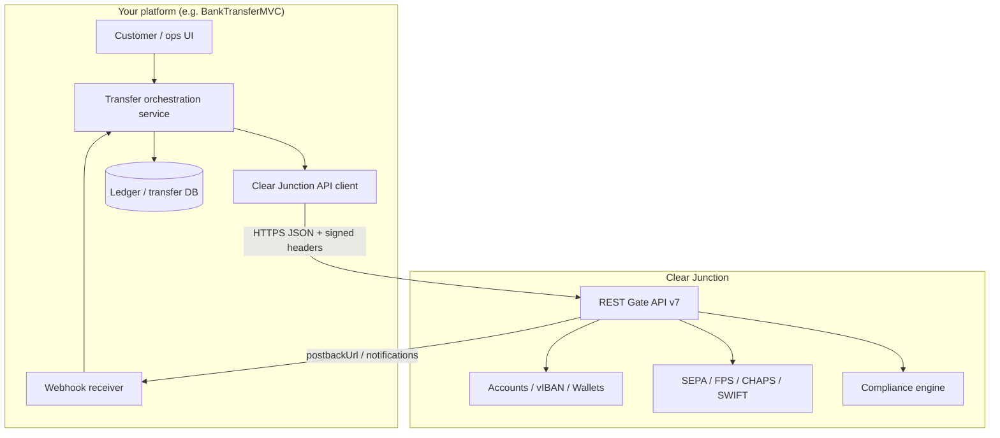
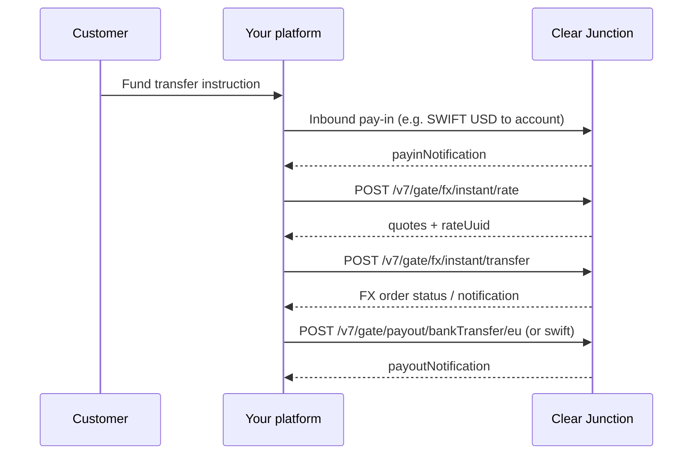

# Clear Junction Integration — Pay-in, Pay-out & Multi-Currency (SWIFT)

| Field | Value |
|-------|-------|
| **Document type** | Business & technical integration specification |
| **Audience** | Product, business analysis, architecture, engineering |
| **Provider** | [Clear Junction](https://clearjunction.com/) — FCA-authorised EMI (FRN 900684) |
| **API reference** | [Clear Junction REST API (Apiary)](https://clearjunctionrestapi.docs.apiary.io/) |
| **API version (gate)** | `v7` |
| **Last API doc sync** | Apiary export dated **2026-04-22** |
| **Target solution** | Bank transfer / remittance platform (e.g. BankTransferMVC PoC) |

---

## 1. Executive summary

Clear Junction provides **regulated financial institutions** with GBP/EUR accounts, **virtual IBANs (vIBANs)**, domestic UK/EU rails, **multi-currency SWIFT** (inbound and outbound), optional **instant FX**, and API or dashboard operations with **maker-checker** controls.

For a typical **remittance / bank-transfer** product:

| Capability | Primary CJ mechanism |
|------------|----------------------|
| **Pay-in (collect funds)** | Credit to **vIBAN** or **named account** → asynchronous **pay-in notification** webhook |
| **FX (optional)** | **Instant FX** API (`/v7/gate/fx/instant/*`) between wallet balances |
| **Pay-out (disburse)** | **Payout execution** APIs per rail; **multi-currency SWIFT** for non-UK/EU corridors |
| **Status & reconciliation** | `clientOrder` + `orderReference`; status APIs; transaction reports; vIBAN mapping |

**Important:** In the published API, **Multi Currency transfer SWIFT** is marked ***implementing*** — treat as a phased capability and confirm go-live scope with Clear Junction before production commitment.

---

## 2. Provider context & eligibility

### 2.1 Who Clear Junction serves

- Licensed **banks, EMIs, fintechs, remittance, FX** firms with strong AML/KYC.
- Onboarding includes licence review, fund-flow design, corridor limits, and a written **scope memo** ([Clear Junction — How it works](https://clearjunction.com/)).

### 2.2 Prerequisites for integration

| Requirement | Notes |
|-------------|-------|
| Active **financial services licence** | Required; CJ onboarding is not self-service for production |
| **API credentials** | `X-API-KEY` (UUID) + `apiPassword` (client-only secret) from CJ |
| **Base URL** | Sandbox and production hosts issued at onboarding (not in public Apiary export) |
| **Webhook endpoints** | HTTPS URLs for pay-in, pay-out, IBAN allocation, FX, etc. |
| **IP allowlisting** | Confirm with CJ solutions team if required |

### 2.3 Regulatory positioning

- Client remains responsible for **KYC, sanctions screening, and transaction monitoring** unless contractually delegated.
- CJ provides **compliance sub-status** on orders (`complianceStatus`) alongside operational status (`operStatus`).

---

## 3. Product capabilities relevant to pay-in / pay-out

Source: [Capabilities — Pay-ins and pay-outs](https://clearjunction.com/solutions/payments/), [SWIFT expansion blog](https://clearjunction.com/blog/clear-junction-expands-swift-connectivity-for-multi-currency-accounts-and-global-payouts/).

### 3.1 Payment rails (summary)

| Rail | Currency (typical) | Direction | API payout endpoint (v7) |
|------|-------------------|-----------|---------------------------|
| SEPA Credit Transfer | EUR | Pay-in / Pay-out | `POST .../bankTransfer/eu` |
| SEPA Instant | EUR | Pay-out | `POST .../bankTransfer/sepaInst` |
| Faster Payments (FPS) | GBP | Pay-in / Pay-out | `POST .../bankTransfer/fps` |
| CHAPS | GBP | Pay-out | `POST .../bankTransfer/chaps` |
| CHAPS Cross Scheme | GBP | Pay-out | `POST .../bankTransfer/chapsCrossScheme` |
| **SWIFT (multi-currency)** | USD, CAD, CHF, etc. | Pay-in / Pay-out | `POST .../bankTransfer/swift` ***implementing*** |
| Wire / T2 | USD, EUR | Per contract | Confirm with CJ |
| Internal (CJ) | GBP, EUR, others | Pay-out | `POST .../internalPayment` |
| Card (pay-in) | Multi | Pay-in | `POST /v7/gate/invoice/creditCard` |

### 3.2 Multi-currency coverage (institution-facing)

CJ documents **named accounts** and SWIFT reach for (among others): **GBP, EUR, USD, CAD, CHF, CZK, HUF, DKK, NOK, PLN, RON, SEK, AUD, TRY, MXN** — subject to **scheme T&Cs and eligibility**.

SWIFT service evolution:

- **Inbound SWIFT** to fund multi-currency positions.
- **Outbound SWIFT** to jurisdictions outside UK/EU.
- **Named client accounts** for transparency (e.g. acquirer settlement).
- **Integrated FX** alongside domestic **SEPA** and **FPS** in one provider ([blog](https://clearjunction.com/blog/clear-junction-expands-swift-connectivity-for-multi-currency-accounts-and-global-payouts/)).

### 3.3 Account structures

| Account type | Business use |
|--------------|--------------|
| **Current** | Operational treasury |
| **Collection** | Pooled incoming funds before allocation |
| **Correspondent** | Banking partner relationships |
| **E-money / wallet** | Client-money segregation; `walletUuid` on API calls |
| **vIBAN** | Per-customer collection & reconciliation |

---

## 4. Integration architecture

### 4.1 Logical components



### 4.2 Correlation & idempotency

| Identifier | Owner | Purpose |
|------------|-------|---------|
| `clientOrder` | **Your system** | Unique idempotency key per payment instruction |
| `orderReference` | **Clear Junction** | CJ order UUID — use for status queries and support |
| `requestReference` | CJ | Per HTTP request trace |
| `messageUuid` | CJ | Individual webhook message id — deduplicate notifications |

**Rule:** Never reuse `clientOrder` for different business payments. On retry after timeout, use the **same** `clientOrder` and query status before re-submitting.

### 4.3 Environments

| Environment | Purpose |
|-------------|---------|
| **Sandbox** | End-to-end integration, webhook testing, compliance field validation |
| **Production** | Live funds — after CJ UAT sign-off |

Apiary provides **mock/proxy** URLs for documentation only; **operational hosts are issued by CJ**.

---

## 5. Security & authentication

### 5.1 Transport & format

- **HTTPS** only.
- **JSON** request/response bodies (`Content-Type: application/json`).
- Timestamps: **ISO 8601 UTC** — `YYYY-MM-DDThh:mm:ss+00:00` (e.g. `2017-08-18T07:34:47+00:00`).

### 5.2 Request headers (every API call)

| Header | Description |
|--------|-------------|
| `Date` | Sender timestamp when the request is formed |
| `X-API-KEY` | API user UUID (provided by CJ) |
| `Authorization` | Request signature (see below) |

### 5.3 Signature (REQUEST SIGNATURE)

Per [Apiary — Authentication](https://clearjunctionrestapi.docs.apiary.io/):

> **REQUEST SIGNATURE** is calculated from **`X-API-KEY`**, **`Date`**, **`RequestBody`**, and **modified `apiPassword`**.

- `apiPassword` is known **only on the client side** (never sent in clear text).
- `401 Unauthorized` when computed signature ≠ `Authorization` header.
- Exact hash algorithm and `apiPassword` transformation are documented in CJ’s diagram (`CJ-interaction.png` in Apiary) — **obtain the formula from CJ integration pack** during onboarding; implement in a dedicated signing module with unit tests against CJ sandbox vectors.

### 5.4 Webhook security

Inbound notifications (pay-in, pay-out, IBAN, FX) use the **same header pattern** (`Date`, `X-API-KEY`, `Authorization`).

**Your webhook handler must:**

1. Verify signature before processing.
2. Respond with **`200`** and body = `orderReference` (plain text UUID per examples).
3. Implement **idempotent** processing on `messageUuid` / `orderReference` + `status` + `operTimestamp`.

### 5.5 Secrets management

Store `X-API-KEY` and `apiPassword` in a secrets vault (Azure Key Vault, AWS Secrets Manager, etc.). Rotate per CJ policy. Do not log request bodies containing PII in production.

---

## 6. Pay-in (collections)

### 6.1 Pay-in models

Clear Junction supports multiple pay-in paths; choose based on product:

| Model | How funds arrive | Your integration |
|-------|------------------|------------------|
| **A. Virtual IBAN** | Payer sends bank transfer to customer-specific vIBAN | Allocate vIBAN → expose to payer → receive **pay-in notification** |
| **B. Named / pooled account** | Transfer to institution account with reference | Reconcile via reference + notifications |
| **C. SWIFT inbound** | International wire to multi-currency account | Fund wallet → pay-out domestically or cross-border |
| **D. Card invoice** | Card payment via CJ invoice API | `POST /v7/gate/invoice/creditCard` |
| **E. onChain** (eligible clients) | Stablecoin → fiat bridge | Separate CJ onChain scope |

For **BankTransferMVC-style bank transfers**, **Model A (vIBAN)** plus **Model C (SWIFT funding)** are the primary patterns.

### 6.2 Virtual IBAN allocation (pay-in enabler)

| Step | API | Notes |
|------|-----|-------|
| 1 | `POST /v7/gate/allocate/v3/create/iban` | Requires `walletUuid`, `registrant`, `ibanCountry`, `ibansGroup` |
| 2 | Poll or webhook | `GET .../allocate/v2/status/iban/orderReference/{uuid}` or IBAN allocation notification |
| 3 | Expose IBAN to end customer | Display bank details for SEPA/FPS/SWIFT inbound per CJ account setup |

**Example request fields:** `clientOrder`, `postbackUrl`, `walletUuid`, `ibanCountry`, `registrant.clientCustomerId`, `registrant.individual` | `corporate`.

### 6.3 Pay-in notification (webhook)

CJ POSTs to your configured URL (documented under **Payin → Payin Notification Message**).

| Field | Meaning |
|-------|---------|
| `type` | `payinNotification` |
| `transactionType` | `Payin` |
| `status` | e.g. `pending`, later lifecycle values |
| `subStatuses.operStatus` | e.g. `captured` |
| `subStatuses.complianceStatus` | e.g. `pending` |
| `currency`, `amount` | Settled or instructed amounts |
| `operationCurrency`, `operationAmount` | May differ when FX involved |
| `payee.walletUuid`, `payee.clientCustomerId` | Credit target |
| `payer` | Originator details when available |
| `paymentDetails` | Rail-specific payload |
| `customInfo` / `customFormat` | Echo of client metadata |

**Response:** HTTP `200`, body = `orderReference` string.

### 6.4 Pay-in status (polling)

| API | Use |
|-----|-----|
| `GET /v7/gate/status/invoice/orderReference/{uuid}` | By CJ reference |
| `GET /v7/gate/status/invoice/clientOrder/{id}` | By your `clientOrder` |

Use polling as **backup** to webhooks (recovery, support tools).

### 6.5 Card pay-in (optional)

`POST /v7/gate/invoice/creditCard` — for card-acquiring scenarios; includes `productName`, `siteAddress`, payer/payee entities. Not required for pure bank-transfer remittance.

---

## 7. Pay-out (disbursements)

### 7.1 Payout execution overview

Base path group: **`/v7/gate/payout`**

| Endpoint | Rail |
|----------|------|
| `POST /v7/gate/payout/internalPayment` | Transfer within CJ |
| `POST /v7/gate/payout/bankTransfer/eu` | SEPA CT (EUR) |
| `POST /v7/gate/payout/bankTransfer/sepaInst` | SEPA Instant |
| `POST /v7/gate/payout/bankTransfer/fps` | UK Faster Payments (GBP) |
| `POST /v7/gate/payout/bankTransfer/chaps` | CHAPS |
| `POST /v7/gate/payout/bankTransfer/chapsCrossScheme` | CHAPS cross-scheme |
| `POST /v7/gate/payout/bankTransfer/swift` | **Multi-currency SWIFT** ***implementing*** |

### 7.2 Common payout request structure

| Field | Required | Description |
|-------|----------|-------------|
| `clientOrder` | Yes | Your unique payment id |
| `currency` | Yes | Payment currency (ISO) |
| `amount` | Yes | Decimal amount |
| `description` | Yes | Payment reference / remittance info |
| `payer` | Yes | `walletUuid`, `clientCustomerId`, `individual` or `corporate` |
| `payee` | Yes | Beneficiary entity |
| `payerRequisite` | Rail-dependent | Source IBAN / account |
| `payeeRequisite` | Rail-dependent | Destination account details |
| `ultimatePayer` / `ultimatePayee` | Compliance | Required for many corridors (individual/corporate) |
| `paymentPurposeCodes` | Corridor-dependent | e.g. `code`: `INTP`, `category`: `GP2P` |
| `postbackUrl` | Recommended | Per-payment webhook override |
| `customInfo` | Optional | Opaque metadata echoed in notifications |

**Response (201 Created):** `orderReference`, `clientOrder`, `status` (e.g. `created`), `subStatuses` (`operStatus`, `complianceStatus`), optional `messages[]` warnings.

### 7.3 Multi-currency SWIFT payout (deep dive)

**Reference:** [Apiary — Multi Currency transfer SWIFT](https://clearjunctionrestapi.docs.apiary.io/#reference/payout/payout-execution/multi-currency-transfer-swift-***implementing***)

#### 7.3.1 Purpose

Send funds to beneficiaries **outside UK/EU domestic schemes**, in supported foreign currencies, using SWIFT. Often used after **SWIFT inbound funding** into a currency position, optionally preceded by **Instant FX**.

#### 7.3.2 Payee requisites (SWIFT-specific)

`payeeRequisite` extends domestic patterns:

```json
"payeeRequisite": {
  "iban": "DE89370400440532013000",
  "institution": {
    "bankSwiftCode": "UBSWCHZH80A",
    "clearingSystemIdCode": "ABA",
    "memberId": "62116001",
    "name": "Bank of America",
    "address": { "country": "IT", "zip": "123455", "city": "Rome", "street": "12 Tourin" }
  },
  "intermediaryInstitution": {
    "bankSwiftCode": "UBSWCHZH80A",
    "clearingSystemIdCode": "ABA",
    "memberId": "62116001",
    "name": "Bank of America",
    "address": { "country": "IT", "zip": "123455", "city": "Rome", "street": "12 Tourin" }
  }
}
```

| Element | Usage |
|---------|--------|
| `iban` | Beneficiary account (IBAN or account per corridor rules) |
| `institution.bankSwiftCode` | Beneficiary bank BIC |
| `institution.clearingSystemIdCode` + `memberId` | e.g. US **ABA** routing |
| `intermediaryInstitution` | Correspondent bank when required |

Validate field mandatory sets per **destination country** with CJ before UAT.

#### 7.3.3 Entity requirements

SWIFT payouts require rich **KYC-style** data:

- **Payer / payee:** `individual` or `corporate` with address, identity documents (individual), registration (corporate).
- **ultimatePayer / ultimatePayee:** Originator/beneficiary of funds for AML (remittance chains).

Use Apiary **Entity Partner** examples: `CorporateSwiftEntity`, `IndividualSwiftEntity`.

#### 7.3.4 Operational notes

| Topic | Guidance |
|-------|----------|
| **Status** | Marked *implementing* — confirm availability per currency/corridor |
| **FX** | If debiting EUR wallet but paying USD SWIFT, use **Instant FX** first or fund USD position via inbound SWIFT |
| **Fees** | Agree deduction model (OUR/SHA/BEN) contractually — not always exposed in public examples |
| **Cut-offs** | SWIFT and FX have operating windows (FX instant: ~06:00–15:00 UK per partner docs) |
| **Compliance holds** | `complianceStatus` may remain `pending` while `operStatus` advances |

### 7.4 Domestic payout examples (comparison)

| Rail | `payeeRequisite` highlights |
|------|----------------------------|
| SEPA | `iban`, optional `bankSwiftCode` |
| FPS | `sortCode`, `accountNumber`, `iban` |
| SWIFT | `iban` + `institution` + optional `intermediaryInstitution` |

### 7.5 Payout notifications & status

| Mechanism | API / behaviour |
|-----------|-----------------|
| Webhook | **Payout Notification Message** — `type`: `payoutNotification`, `transactionType`: `Payout` |
| Return webhook | **PayoutReturn Notification Message** — handle reversals/recalls |
| Poll by CJ id | `GET /v7/gate/status/payout/orderReference/{uuid}` |
| Poll by client id | `GET /v7/gate/status/payout/clientOrder/{id}` |

### 7.6 Transaction actions (maker-checker)

If your CJ contract uses approval workflows:

| API | Action |
|-----|--------|
| `POST /v7/gate/transactionAction/approve` | Approve pending transaction |
| `POST /v7/gate/transactionAction/cancel` | Cancel before settlement |

Align UI/workflow in ops portal with these states.

---

## 8. Foreign exchange (multi-currency positions)

When collection currency ≠ pay-out currency:



### 8.1 Instant FX APIs

| Step | Endpoint |
|------|----------|
| Get quote | `POST /v7/gate/fx/instant/rate` — body: `sellCurrency`, `buyCurrency` |
| Execute | `POST /v7/gate/fx/instant/transfer` — `rateUuid`, amounts, `clientOrder`, `postbackUrl` |
| Status | `GET .../fx/instant/status/orderReference/{uuid}` or `clientOrder/{id}` |

### 8.2 FX business constraints (partner documentation)

| Constraint | Typical value |
|------------|---------------|
| Minimum | 500 EUR / GBP / USD equivalent |
| Maximum per trade | ~200,000 EUR equivalent |
| Daily limit | ~1,000,000 EUR equivalent |
| Daily trade count | 50 |
| Tradable rates hours | ~06:00–15:00 UK |

Indicative vs tradable rates: outside hours, rate requests may error — design UX accordingly.

---

## 9. Wallets & client money

| API area | Purpose |
|----------|---------|
| `POST /v7/gate/wallets/corporate` | Reserve corporate customer wallet |
| `GET /v7/gate/wallets/{uuid}` | Wallet details & payment methods |
| `POST /v7/gate/wallets/transfer` | Internal wallet transfer |
| `POST /v7/gate/wallets/statement` | Statements for reconciliation |

Most payout/pay-in calls reference **`walletUuid`** and **`clientCustomerId`** to identify the regulated end-customer or sub-client.

---

## 10. Supporting services

| Service | Endpoint | Use |
|---------|----------|-----|
| **Confirmation of Payee** | `POST /v7/gate/checkRequisite/cop` | UK name verification before FPS/CHAPS |
| **SEPA IBAN check** | `GET /v7/gate/checkRequisite/bankTransfer/eu/iban/{iban}` | Validate SEPA reachability |
| **Transaction report** | `POST /v7/gate/reports/transactionReport` | Bulk reconciliation export |
| **Refunds** | `/v7/gate/refund` | Incoming/outgoing refund flows |

---

## 11. End-to-end remittance flow (reference)

Typical **international remittance** using CJ multi-currency SWIFT + EU domestic pay-out:

| # | Step | Actor |
|---|------|-------|
| 1 | Allocate vIBAN to sender (or provide pooled account + unique reference) | Your platform → CJ |
| 2 | Sender funds vIBAN via local rail or SWIFT | Sender bank → CJ |
| 3 | Receive `payinNotification`; credit internal ledger | CJ → Your platform |
| 4 | Optional: FX if collection ccy ≠ pay-out ccy | Your platform → CJ |
| 5 | Create payout (`bankTransfer/eu`, `fps`, or `swift`) | Your platform → CJ |
| 6 | Track `payoutNotification`; update transfer status | CJ → Your platform |
| 7 | Reconcile using reports + wallet statements | Ops / finance |

---

## 12. Data dictionary (core fields)

| Field | Type | Description |
|-------|------|-------------|
| `clientOrder` | string | Client-supplied unique order id |
| `orderReference` | UUID | CJ order identifier |
| `requestReference` | UUID | Per-request id |
| `walletUuid` | UUID | CJ wallet / client-money account |
| `clientCustomerId` | string | Your customer reference |
| `status` | enum | Order-level status (`created`, `pending`, `accepted`, …) |
| `subStatuses.operStatus` | enum | Operational pipeline (`pending`, `captured`, …) |
| `subStatuses.complianceStatus` | enum | Compliance pipeline |
| `messages[]` | array | Warning/error codes from CJ |
| `paymentPurposeCodes.code` | string | Purpose of payment (e.g. `INTP`) |
| `paymentPurposeCodes.category` | string | Category (e.g. `GP2P`) |
| `postbackUrl` | URL | Webhook callback for this order |
| `customInfo` | object | Client metadata round-trip |

---

## 13. Error handling

### 13.1 HTTP status codes

| Code | Meaning | Action |
|------|---------|--------|
| 200 | OK | Process response |
| 201 | Created | Store `orderReference` |
| 400 | Bad request | Fix parameters; do not retry blindly |
| 401 | Unauthorized | Check signature, clock skew, credentials |
| 404 | Not found | Verify URL and ids |
| 409 | Validation conflict | Parse `errors[]`; fix mandatory fields/format |
| 500 | CJ internal error | Retry with backoff; escalate if persistent |

### 13.2 Error body

```json
{
  "errors": [{
    "code": "30",
    "message": "Validation error",
    "details": "Wrong period dates"
  }]
}
```

Log `code` + `details`; map known codes to user-facing messages in your app layer.

---

## 14. Reconciliation & reporting

| Technique | Description |
|-----------|-------------|
| **vIBAN → clientCustomerId** | One-to-one mapping for inbound attribution |
| **clientOrder** | Tie API calls to internal `TransferId` |
| **Dual status tracking** | `operStatus` vs `complianceStatus` — UI should show both |
| **Webhook + poll** | Webhook primary; poll for missed events |
| **Transaction report API** | Periodic batch match to internal ledger |
| **Wallet statements** | End-of-day balance checks |

---

## 15. Implementation plan (BankTransferMVC / .NET)

Suggested phased delivery:

### Phase 0 — Onboarding (parallel)

- [ ] CJ commercial & compliance onboarding
- [ ] Obtain sandbox `X-API-KEY`, `apiPassword`, base URL, webhook secrets
- [ ] Confirm enabled rails (SEPA, FPS, SWIFT currencies)

### Phase 1 — Foundation

- [ ] `ClearJunctionOptions` configuration (Key Vault)
- [ ] `ClearJunctionSignatureService` — sign outbound requests; verify inbound webhooks
- [ ] `ClearJunctionHttpClient` — typed `HttpClient` with delegating handler for headers
- [ ] Health check against status or lightweight GET

### Phase 2 — Pay-in

- [ ] vIBAN allocation workflow + persistence (`IbanAllocation` entity)
- [ ] `PayinWebhookController` — verify signature, idempotent handler
- [ ] Link pay-in to `Transfer` / `Funding` records in DB

### Phase 3 — Pay-out (domestic)

- [ ] Payout service — SEPA + FPS mappers from domain model to CJ JSON
- [ ] `PayoutWebhookController`
- [ ] Status polling fallback job

### Phase 4 — Multi-currency

- [ ] Instant FX service (rate → transfer)
- [ ] SWIFT payout mapper (`payeeRequisite.institution`, ultimate parties)
- [ ] Corridor configuration table (country → required fields)

### Phase 5 — Ops & compliance

- [ ] CoP / IBAN check integration before payout
- [ ] Transaction report ingestion
- [ ] Maker-checker admin UI (if applicable)

### Suggested project structure

```
BankTransferMVC/
  Integrations/
    ClearJunction/
      ClearJunctionClient.cs
      ClearJunctionSignatureService.cs
      Models/
      Mappers/
  Controllers/
    Webhooks/
      ClearJunctionPayinController.cs
      ClearJunctionPayoutController.cs
```

---

## 16. Testing strategy

| Test type | Approach |
|-----------|----------|
| **Signature unit tests** | Vectors from CJ integration guide |
| **Contract tests** | Recorded sandbox responses per rail |
| **Webhook tests** | ngrok / Azure relay → local handler |
| **Idempotency** | Duplicate `clientOrder` and duplicate `messageUuid` |
| **Negative paths** | 401 (bad signature), 409 (validation), insufficient balance |
| **E2E** | Sandbox vIBAN → simulated pay-in → FX → SEPA/SWIFT pay-out |

Apiary mock server (`*.apiary-mock.com`) is useful for **schema exploration**, not business logic validation.

---

## 17. Risks, assumptions & open points

| Item | Impact | Mitigation |
|------|--------|------------|
| SWIFT payout marked ***implementing*** | May block some corridors | Early CJ roadmap confirmation |
| SEPA Instant availability | Partner matrix may show gaps | Fallback to SEPA CT |
| Signature algorithm in image only | Implementation risk | Request written spec + test vectors from CJ |
| Base URLs not public | Misconfiguration | Store per environment in secure config |
| FX hours & minimums | User-facing failures | Display cut-offs; pre-validate amounts |
| FI vs customer pay-out matrix | Q2 features on website grid | Confirm contract scope |
| PCI card pay-in | Out of scope for bank-transfer MVP | Exclude unless required |

**Open questions for Clear Junction:**

1. Production and sandbox **base URLs** and IP requirements.
2. Exact **signature algorithm** and clock tolerance for `Date`.
3. **SWIFT implementing** — currencies, countries, and go-live date.
4. Fee model and **charge bearer** for SWIFT.
5. Webhook retry policy and ordering guarantees.
6. Required **payment purpose codes** per corridor/regulator.

---

## 18. API quick reference (v7)

### Pay-in

| Method | Path |
|--------|------|
| POST | `/v7/gate/invoice/creditCard` |
| GET | `/v7/gate/status/invoice/orderReference/{uuid}` |
| GET | `/v7/gate/status/invoice/clientOrder/{id}` |

### Pay-out

| Method | Path |
|--------|------|
| POST | `/v7/gate/payout/internalPayment` |
| POST | `/v7/gate/payout/bankTransfer/eu` |
| POST | `/v7/gate/payout/bankTransfer/sepaInst` |
| POST | `/v7/gate/payout/bankTransfer/fps` |
| POST | `/v7/gate/payout/bankTransfer/chaps` |
| POST | `/v7/gate/payout/bankTransfer/chapsCrossScheme` |
| POST | `/v7/gate/payout/bankTransfer/swift` |
| GET | `/v7/gate/status/payout/orderReference/{uuid}` |
| GET | `/v7/gate/status/payout/clientOrder/{id}` |

### Virtual accounts

| Method | Path |
|--------|------|
| POST | `/v7/gate/allocate/v3/create/iban` |
| GET | `/v7/gate/allocate/v2/status/iban/orderReference/{uuid}` |
| GET | `/v7/gate/allocate/v2/list/iban/{clientCustomerId}` |

### FX

| Method | Path |
|--------|------|
| POST | `/v7/gate/fx/instant/rate` |
| POST | `/v7/gate/fx/instant/transfer` |
| GET | `/v7/gate/fx/instant/status/orderReference/{uuid}` |
| GET | `/v7/gate/fx/instant/status/clientOrder/{id}` |

---

## 19. References

| Resource | URL |
|----------|-----|
| Clear Junction corporate site | https://clearjunction.com/ |
| Pay-ins / pay-outs capabilities | https://clearjunction.com/solutions/payments/ |
| SWIFT multi-currency expansion | https://clearjunction.com/blog/clear-junction-expands-swift-connectivity-for-multi-currency-accounts-and-global-payouts/ |
| REST API (Apiary) | https://clearjunctionrestapi.docs.apiary.io/ |
| Multi-currency SWIFT payout | https://clearjunctionrestapi.docs.apiary.io/#reference/payout/payout-execution/multi-currency-transfer-swift-***implementing*** |
| Partner capability matrix (Crassula) | https://help.crassula.io/knowledge/clear-junction |

---

## 20. Document control

| Version | Date | Author | Changes |
|---------|------|--------|---------|
| 1.0 | 2026-05-19 | Business analysis | Initial integration specification from Apiary v7 export and CJ public product docs |

---

*This document is based on publicly available Clear Junction materials and the Apiary API export. Production behaviour, enabled corridors, and signature implementation details must be confirmed with Clear Junction during onboarding.*
